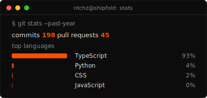
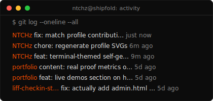
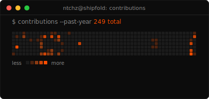
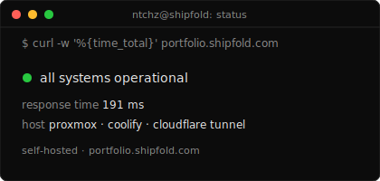

  

  
  

  
  

  
  

---

### Featured Work

Flagship systems (mostly private / client & org repos):

| Project | What it is | Stack |
|---------|------------|-------|
| 🤖 **Multi-LLM Chat Platform** | ChatGPT-style multi-provider LLM chat with RAG | FastAPI · Next.js · Docker · Vector DB |
| 📘 **SmartMath** | AI math learning platform — RAG + OCR pipeline | Next.js · PostgreSQL · Docker |
| 🛠️ **Repair Service Platform** | Multi-service repair platform (LIFF + dashboard + PDF engine) | Elysia · Bun · Nuxt · Python |
| 📦 **Logistics LINE OA Manager** | LINE OA tracking + group-manager bot + infra | Next.js · Bun · Prisma · Docker |
| 🏠 **Dormitory Management Suite** | Housing CRM + tenant frontend + API | Next.js · Elysia · Bun · Prisma |
| 📱 **Field Ops Platform** | Admin dashboard + REST API + mobile app | Next.js · Express · Expo |
| 🎁 **Loyalty & Rewards LIFF** | Real-world customer loyalty & rewards platform | Next.js · Prisma · MinIO |
| 💪 **Fitness Brand Platform** | Fitness brand platform & landing | Next.js · Bun · Tailwind |
| 📅 **Meeting LIFF** | LINE LIFF meeting + QR document flow | Next.js · Bun · Prisma |
| 🎥 **CCTV Tracking** | Computer-vision people/object tracking | Python · OpenCV |
| 👥 **Uniqal Staff** | Staff / workforce management system | Next.js · Prisma · Tailwind |
| 🤳 **Facebook Automation** | Automated FB page / content workflows | Next.js · Prisma |
| 🧠 **AI Content Planner** | Multi-workspace social SaaS with AI planner & LINE | React · Supabase · shadcn |
| 🩺 **Nurse / Vein Analysis** | Research tool for medical vein detection | Next.js · Drizzle · Tailwind |
| 📇 **Dormitory Suite CRM** | Housing sales & customer CRM dashboard | Next.js · React · Tailwind |
| 🔮 **Dukpyra** | Pythonic web framework powered by .NET | Python · .NET |

---

### Open Source

Things you can actually clone:

- **[off-by-none](https://github.com/NTCHz/off-by-none)** — Claude Code skill for spec-faithful implementation: spec-derived tests, mandatory boundary coverage, adversarial spec re-reads.
- **[liff-checkin-starter](https://github.com/NTCHz/liff-checkin-starter)** — minimal LINE LIFF event check-in starter (Bun + Elysia), works in a plain browser via demo mode.
- **[multitenant-ecommerce](https://github.com/NTCHz/multitenant-ecommerce)** — multi-tenant e-commerce built on Next.js.
- **[Village-Security](https://github.com/NTCHz/Village-Security)** — microservices security platform (auth · dashboard · DevOps).

---

### Let's Talk If You're Into

- RAG & LLM systems, especially **Thai / SEA language** knowledge bases
- **LINE Platform** apps — LIFF, OA bots, messaging automation
- Elysia + Bun backends and multi-service architecture
- OCR / embeddings / vector search in real products

---

### Connect

  
  
  
  
  
  

